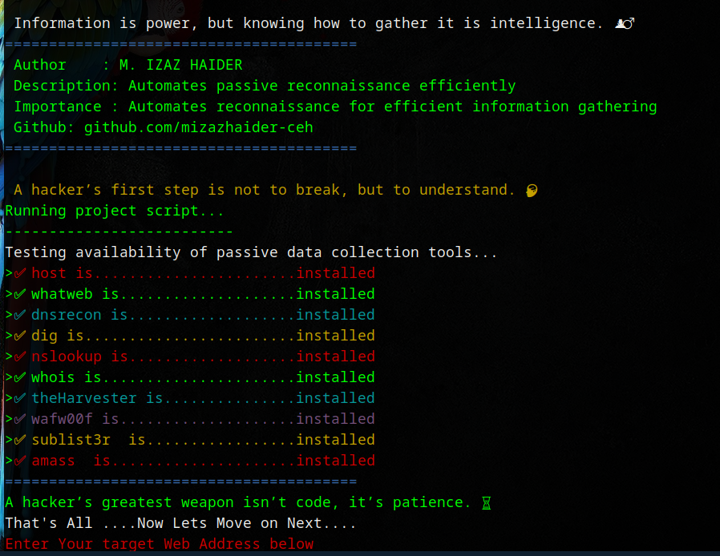
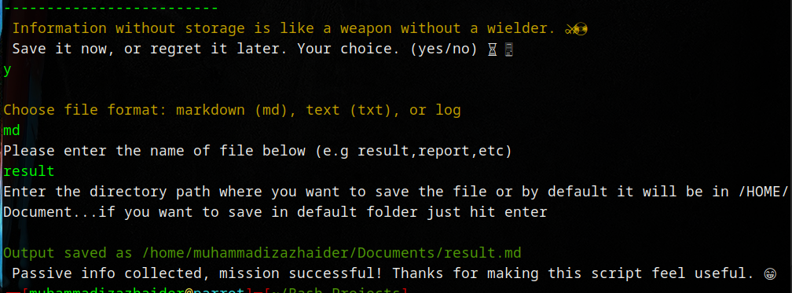

#                        ⚡ Passive Automation V.3.1 ⚡
#


## 📝 Overview

Passive Automation V.3.1 is a  Bash script designed by M.izaz Haider to  automate passive reconnaissance efficiently. The script  streamlines the process of gathering  valuable  about a  target without actively engaging with it, ensuring that it remains within  legal boundaries and does not  alert the Target. This script is particularly useful for 🛡️ cybersecurity professionals and 🏴‍☠️ ethical hackers.

## ⭐ Features

* 🤖 Automates passive  reconnaissance using widely used 🛠️.
* Ensures  legality by relying solely on passive  gathering techniques.
* 🚀 Speeds up  tasks that would otherwise take ⏳.
* 📊 Provides detailed  on the availability of  🛠️.
* 🎛️ Interactive prompt for input and target-based execution.
* 🎨 Uses color-coded output for better 👀 readability and 🧑‍💻 user experience.

## 🖼️ Screenshots

Here are some visuals of the script in action:

### 💻 Running the Script
 

### 📺 Script Output


## 🏆 Use Cases & Benefits

Passive Automation V.3.1 is a powerful 🛠️ for cybersecurity professionals, ethical hackers, and researchers. Here’s how it can be beneficial:

### 🔍 **Use Cases**

✅ **Penetration Testing Preparation** – Helps in gathering passive ℹ️ before active testing.
✅ **Bug Bounty Programs** – Assists researchers in discovering potential vulnerabilities.
✅ **Cyber Threat Intelligence** – Enables analysts to collect critical insights about a 🎯.
✅ **Reconnaissance for Red Teaming** – Supports ethical hackers in simulating real-world 🏴‍☠️ attack scenarios.
✅ **Corporate Security Assessments** – Helps organizations monitor their own online exposure.

### 🎯 **Key Benefits**

🚀 **Saves Time** – Automates multiple reconnaissance 🛠️, reducing manual efforts.
🛡️ **Stealth Mode** – Avoids active scanning, keeping engagement undetected.
📊 **Comprehensive Reports** – Provides a detailed breakdown of collected ℹ️.
⚖️ **Legally Compliant** – Ensures all reconnaissance follows ethical and legal boundaries.

## 🛠️ Tools Utilized

This 🖥️ checks for the availability of and utilizes the following passive ℹ️ gathering 🛠️:

* `host` - Performs 🌐 DNS lookups.
* `whatweb` - Identifies 🕸️ web technologies.
* `dnsrecon` - Conducts advanced 🌐 DNS enumeration.
* `dig` - Queries 🌐 DNS records.
* `nslookup` - Retrieves 🌐 DNS ℹ️.
* `whois` - Fetches 🔍 domain registration details.
* `theHarvester` - Gathers 📡 open-source intelligence.
* `wafw00f` - Detects 🛡️ web application firewalls.
* `sublist3r` - Enumerates 🌐 subdomains.
* `amass` - Maps out an organization's 🌍 external attack surface.

## ⚙️ Installation

Ensure that the required 🛠️ are installed before running the 🖥️. You can install them using:

```bash
sudo apt update && sudo apt install -y dnsutils whois whatweb dnsrecon theharvester wafw00f sublist3r amass
```

## 🚀 Usage

1. 📥 Clone the 📂 repository:
   ```bash
   git clone https://github.com/mizazhaider-ceh/passive-automation.git
   ```
2. 📂 Navigate to the 🖥️ directory:
   ```bash
   cd passive-automation
   ```
3. ✅ Grant execution permissions:
   ```bash
   chmod +x passive-automation.sh
   ```
4. ▶️ Run the 🖥️:
   ```bash
   ./passive-automation.sh
   ```
5. ⌨️ Enter the 🎯 domain when prompted and follow the 📺 on-screen instructions.

## ⚖️ Legal Disclaimer

This 🖥️ is intended for 🎓 educational and 🏴‍☠️ ethical hacking purposes only. 🚫 Unauthorized use against systems you do not own or have explicit ✍️ permission to test is 🚔 illegal and punishable under 🛡️ cybersecurity laws. The ✍️ author is not responsible for any 🚨 misuse of this 🛠️.

## ✍️ Author / Developer

**M. Izaz Haider**

GitHub: [github.com/mizazhaider-ceh](https://github.com/mizazhaider-ceh)
Linkedin:
[https://www.linkedin.com/in/muhammad-izaz-haider-091639314]

## 📜 License

This 📂 is licensed under the 🏛️ MIT License - see the [LICENSE](LICENSE) 📄 for details.
